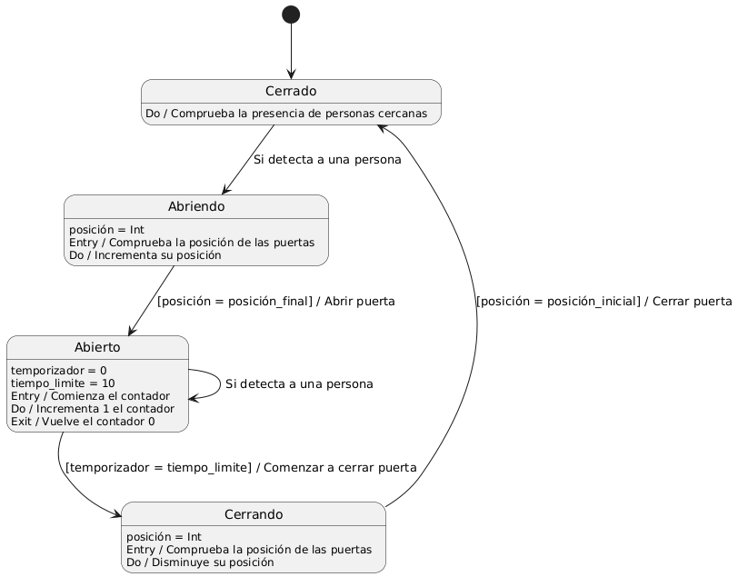

# EDES-diagrama-de-estados

    @startuml

    [*] --> Cerrado
    Cerrado --> Abriendo : Si detecta a una persona
    Abriendo --> Abierto : [posición = posición_final] / Abrir puerta
    Abierto --> Cerrando : [temporizador = tiempo_limite] / Comenzar a cerrar puerta
    Cerrando --> Cerrado : [posición = posición_inicial] / Cerrar puerta
    Abierto --> Abierto : Si detecta a una persona

    Cerrado : Do / Comprueba la presencia de personas cercanas

    Abriendo : posición = Int
    Abriendo : Entry / Comprueba la posición de las puertas 
    Abriendo : Do / Incrementa su posición

    Abierto : temporizador = 0
    Abierto : tiempo_limite = 10
    Abierto : Entry / Comienza el contador
    Abierto : Do / Incrementa 1 el contador
    Abierto : Exit / Vuelve el contador 0

    Cerrando : posición = Int
    Cerrando : Entry / Comprueba la posición de las puertas
    Cerrando : Do / Disminuye su posición

    @enduml

## Explicación del diagrama de estados
El diagrama está compuesto por 4 estados: 
- Cerrado
- Abriendo
- Abierto
- Cerrando

Como la puerta está cerrada de forma predeterminada, el diagrama comienza en **Cerrado**. Si la puerta detecta alguna persona, el estado cambiará y pasará al estado **Abriendo**.

Mientras está en el estado **Abriendo**, las puertas incrementan su posición hasta llegar a la posición final, es decir, van cambiando su posición hasta estar completamente abiertas. No cambiará de estado hasta alcanzar su posición final.

Una vez alcancen la posición final se pasará del estado **Abriendo** a **Abierto**, y aquí dará comienzo un contador: Cada segundo que pase este contador irá incrementándose hasta llegar a 10. Si el contador alcanzar 10, se pasará del estado **Abierto** a **Cerrando**. Sin embargo, si se detecta alguna persona durante este proceso, el contador volverá a reiniciarse y tomará el valor de 0. Esto es para prevenir que se cierren mientras cruzan los distintos individuos por la puerta.

El estado **Cerrando**, es bastante similar a **Abriendo** pero en vez de incrementar su posición hasta alcanzar la posición final y por tanto abrirse, aquí la posición irá disminuyendo hasta alcanzar la posición inicial. No será hasta que alcance la posición inicial que el programa volverá al estado **Cerrado**.